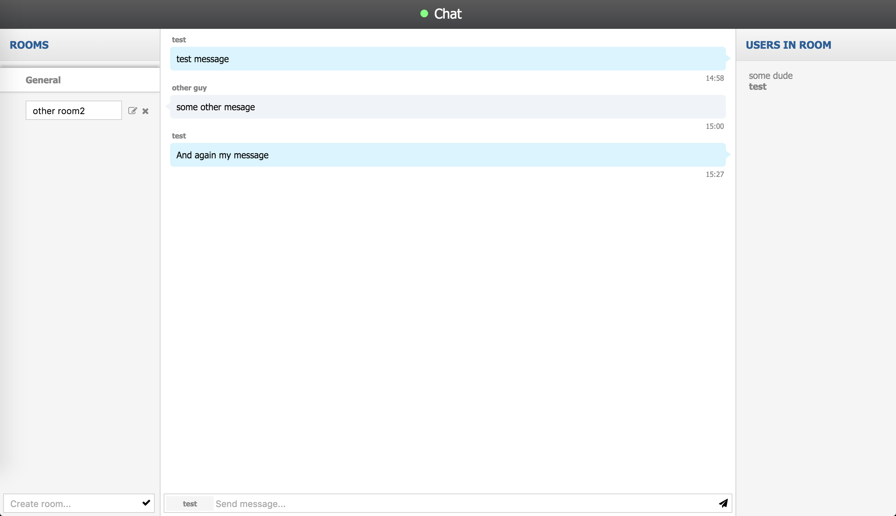
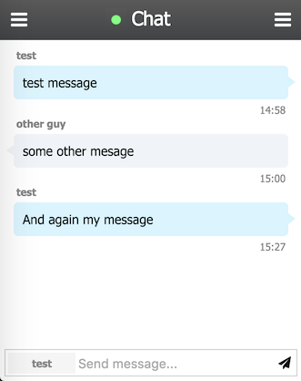
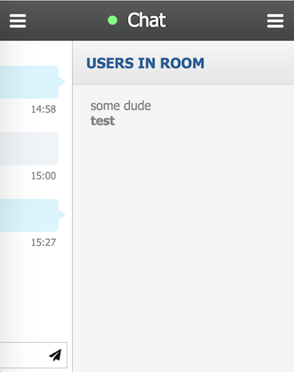

Frontend test v2
===========
You should create simple web chat application. All data needed to complete this goal is presented in the
current repository.

## Design
* Desktop

* Mobile

Task description
-------------------
This task is all about creating a simple web chat application, which is supports creating rooms
and exchanging messages. Application should connect via sockets to the server with
support of fallback to XHR (or JSONP) - if web sockets are not supported by the browser.

The application should firstly ask a user for his username and login him to the chat server.

The login system is quite simple - you should send event **'login'** to the server with object contains
your username `{ username: 'cool guy' }`. The server in case of successful login would reply
you with event **'setup'** which contains data about available rooms and after that the server also
will send you event **'switched room'** which would tell the client that he is connected to default room.

The server will send client events **'message created'** when new message incomes into current room.
The client in this case should notify user (via beep sound and notification API if it is available in
the browser) and display it.

Client can write messages into current room via **'new message'** with providing `{ message: 'New message' }`.
In this case server will send everyone else in this room event **'message created'** containing this message.

User can also create, edit and remove his own rooms. His own - means the room created by person with some username -
quite simple.

From time to time server can be unstable and disconnect the users. In this case the client should try to reconnect
to see if server is up again and if it is - reconnect to it following the same login procedure (but using same username).

## Task specification

- User should be able to pick up his username when he is connecting to the chat
- Username is unique - server will send an error if user with same username is already logged in.
You should support such situations and ask user to reenter username
- User should see available rooms, can switch them, can create and delete own rooms
- User should see other users in room
- If user deleted own room, other users which were in this room should be redirected to default room
- When user is connected in some room, last few messages from room should be showed
- If app lose connection, it should try to reconnect. After reconnecting it should automatically switch to room
user was connected
- When new message arrives to the client, it should play beep sound and show notification (if browser supports it)
- When user tries to close the tab contains web application browser should show alert with question if user really
wants to close the tab
- When user entered data to some input (e.g. message field) - by pressing enter app should send the message. Also
the same story when user is editing room name

## Frontend

- HTML5 doctype should be used
- SCSS/SASS should be used
- Use REM
- Application should be responsible
- For building UI use only the features of the CSS. Except icons - feel free to use font-awesome
- Make hover states for the buttons according your tastes (e.g. change opacity etc)
- In users sidebar user username should be semibold.
- Use HTML5 API methods for **notification** and **playing sound alarm** when new message incomes. Sound located in
assets folder inside this repo.

## Other
- All sources should be committed to public source repository, such as: http://github.com, http://bitbucket.org, etc
- Feel free to use 3rd party libraries and frameworks (like jQuery, backbone, sass etc...)

Additional plus
-----------------
- Using any of module loader (e.g. require.js)
- Using Task Runner (e.g. Gulp) for concatenation, minifying etc
- **Using your own backend**. If you dare, the requirements for it should be just the same as for the task.

API
-----------------
Address: http://

## Data Types
* **User**
    * **name**: String
    * **created**: Date
* **Room**
    * **name**: String
    * **created**: Date
    * **user**: User
    * **default**: Boolean
* **Message**
    * **content**: String
    * **created**: Date
    * **user**: User
    * **room**: Room

## Socket queries:
* **login** ( { username: String } )
    * Sends **user joined** to already logged in users
    * Sends **setup** to you
    * *Throws **appError** - wrong username, username already logged in*
* **new room** ( { name: String } )
    * Sends **room created** to users
    * *Throws **appError** - wrong room name or already exists*
* **edit room** ( { id: String, name: String, remove: Boolean } )
    * Sends **room updated** or **room removed**
    * *Throws **appError** - wrong room names, room not found or room isn't yours*
* **switch room** ( { room: Room } )
    * Sends **user left** and **user joined** for other clients
    * Sends **room switched** to you
    * *Throws **appError** - wrong room*
* **new message** ( { message: String } )
    * Sends **mesage created**
    * *Throws **appError** - no message*

## Socket events:
* **appError** *[@you]* ( { id: Number (Error Code), message: String } )
* **setup** *[@you]* ( { rooms: [Room], users: [User], messages: [Message] } )
* **room created** *[@wide]* ( Room )
* **room updated** *[@wide]* ( Room )
* **room removed** *[@wide]* ( Room )
* **user joined** *[@room]* ( [User] )
* **user left** *[@room]* ( [User] )
* **room switched** *[@you]* ( { messages: [Message], users: [User], room: Room } )
* **message created** *[@room]* ( Message )

## Error Codes
* **0**: Not Authenticated
* **10**: No username provided
* **11**: User already logged in
* **20**: Room name should be provided
* **21**: Room with provided name exists
* **22**: Room id should be provided
* **23**: Room not found
* **24**: Room is not yours
* **25**: Bad new room name provided
* **30**: Bad new message content provided

## Event flow example
User logs in via `socket.emit('login', {username: 'My nick'})`. Now application listens to
either `socket.on('appError')` if username is taken *(or some else error happened)* or to
`socket.on('setup')` - which tells you successfully logged in and it is gives you data about rooms,
 users and messages in default room which you are in.

You can send a message via `socket.emit('new message', {message: 'hi'})` and receive back either `appError` or
`messageCreated`.

The same story with other events. If you lost your connection (it can happens time to time in chats) - you
should be able to reconnect - just repeat login procedure - `socket.emit('login')` and wait for `socket.on('setup')`.